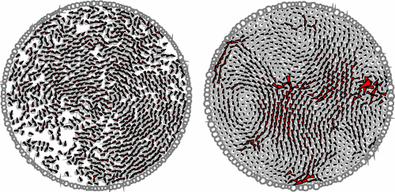

## Crowds
Crowds are an example of a complex system that displays emergent behaviour. Such behaviour is a result of the aggregation of interactions between many individuals. Understanding crowd dynamics is very important in a growing society and can have wide reaching benefits in design, safety and transport. Understanding group behaviour has even further potential for applications involving animal behaviour, cell growth and emerging fields such as swarm intelligence. 

## Goals
The goal of this project was to create an implementation of a flexible crowd model that was capable of exploring and describing some frequently observed crowd phenomena. with the ultimate goal of being able to apply the model to common evacuation scenarios and identifing the role of exits and obstacles to evacuation speed and the danger of crushing due to high pressure zones.

## A simple base
As with any problem, it is important to first gain an understanding of what features and results are important to pay attention to. That way correct and genuinely interesting behaviour can be identified and bugs squashed equally as efficiently.

---
## Vicsek Model
In 1995 Tamás Vicsek et al. published a paper detailing a model for Collective motion and swarming behaviour. Simple rules for individuals in a collective can  result in unified behavior on larger scales. This model became arguably on of the most influential in the space of describing these kind of aggregate group behaviours and has since been adapted and applied to many more problems in the same space.

## Active Jam Model

## Tooling
So with reasonably well defined goals and a simple model to work with and get up to speed on we set out to create the tools necessary to explore the problem. To Generate a wide range of senarios we decided that in engine editing tools would be very useful for defining spaces and starting conditions. Some basic building blocks were implemented while creating a system that allowed interchange of more advanced assets and functionality.

### Low or High
When the question of what Language to use arose it was clear that there was no perfect choice, I will also have to admit my relative familiarity with these languages in particular had a large influence on what I did choose. The lower level nature and speed of compiled C/C++ with its abundance of highly efficient libraries made it a preferable choice for the simulation. Whereas the higher level nature and flexibility of Python and its highly developed and easily usable analysis modules made it a straightforward selection for analysis. Therefore we decided not to decide between the two and used both - win/win. This resulted in a simulation environment that could handle thousands of agents and cope with running in or beyond realtime timescales and a high degree of analytical tools at our disposable. Although this did also result in much more development time - not so win.

## Walls

  <video width="500" height="500" style="float:left; padding-right: 15px; padding-top: 0px;" loop autoplay controls>
    <source src="http://flandan.github.io/images/Walls.mp4" type="video/mp4">
  Your browser does not support the video tag.
  </video>

Basic walls were implemented by applying force perpendicular to the wall vector when an agent came within range. This is a very simplified solution that works for high repulsive forces and low density of agents. It however breaks down as density increses and the inter-agent forces begin to build up. There is room for a more advanced solving method here but for most of our purposes it served well enough.

## Spawn Zones

  <video width="500" height="500" style="float:right;" loop autoplay controls>
    <source src="http://flandan.github.io/images/SpawnBoxes.mp4" type="video/mp4">
  Your browser does not support the video tag.
  </video>

If you want control over initial conditions you need to be able to define an initial zone for randomly placing your agents is essential. This was acheched with "spawn zones" in which the agents are equally split and randomly distributed within each zone according to a gaussian distribution.

## Attractors

  <video width="500" height="500" style="float:left;" loop autoplay controls>
    <source src="http://flandan.github.io/images/Attractors.mp4" type="video/mp4">
  Your browser does not support the video tag.
  </video>

To give some incentive to move to a goal, attractors were added. Each attractor adds a bias to the agents desired heading according to their offset. The Attraction is only active within a zone of attraction - a hand placed rectangular zone acting as a vector field. Again, a simple solution but enabling many possibilities to define senarios such as evacuation.

## Scenario

  
  
  
  

  
  
  
  

A very basic room evacuation scenario was devised and it was decided to look at the density and pressure at various points in the doorway over time. Although this scenario was very basic it highlighted some issues with the way we were measuring pressure and density - respectively they were in fact the local pressure and density of one grid square. Due to time constraints a more accurate measure could not be found and a more elaborate problem could not be worked through, as far as the thesis goes and so the full potential of these tools have not yet been realised. I intend, as part of refactoring and cleaning up the code, to investigate further.

## Analysis
### In Engine

  
  

Using the realtime graphics features of the [SFML (Simple Fast Multimedia Library)](https://www.sfml-dev.org/)  agents, walls, spawn boxes and attractor zones were rendered per frame of simulation. Local density and pressure were also rendered on a colourised grid according to the occupying agents. Helper tools with snap to grid functionality were added to enable experimental repeatability in lieu of a save system. A graphical user interface for initial conditions and various simulation options was added using [SFGUI (Simple Fast Graphical User Interface)](https://github.com/TankOs/SFGUI), a simple but rich ui library built for use with SFML.

### In Python

  

    <object width="400" height="300" type="application/pdf" data="https://flandan.github.io/images/obs1_figure_Psmooth_vs_Ninside_doorwidth.pdf?#zoom=50&scrollbar=0&toolbar=0&navpanes=0" id="pdf_content">
      
PDF cannot be displayed.

    </object>
  

  

    <object width="400" height="300" type="application/pdf" data="https://flandan.github.io/images/obs1_figure_Psmooth_vs_Time_doorwidth.pdf?#zoom=50&scrollbar=0&toolbar=0&navpanes=0" id="pdf_content">
      
PDF cannot be displayed.

    </object>
  

The C++ engine was modified to save out both images rendered at certain timestamps and detailed point cloud data for analysis in Python. This gave huge flexibility in investigation of the data and presenting results, both things that Python and partictularly packages such as numpy, scipy and matplotlib are very good at.

## Conclusion
While the results were interesting it was clear that the chosen scenario was slightly flawed and some of the choices for analysis and implementation were also not totally fit for purpose. Given the flexibilty that the tools allow, a much more intricate scenario with better defined investigation measures would have almost certainly been a better option. However, this was an academic project and due to time contraints this was what we had to follow through with. The use of C++ and Python was an excellent choice but again, learning the nuances of two languages for an academic project like this was another time burner. On a more positive note, it was clear that having an interactive UI was invaluable in getting a feel for how a model would behave and react in different configurations. Fields for noise, speed and repulsion parameters could all be changed on the fly and spaces entirely redesigned with only a few clicks of the mouse instead of editing a config file and rerunning as is so often the case with these kind of projects. I would like to see a move away from purely commandline simulations for scenarios where visual feedback is so important in investigation and understanding. I look forward to developing this idea as I move forward.

I also look forward to the long overdue refactoring this project is in great need of. Source code will be on its way to [github](https://github.com/Flandan) soon!
You can read more about this project in greater detail in my [thesis](https://github.com/Flandan/flandan.github.io/blob/master/images/Crowd_Modeling.pdf).